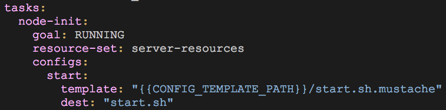
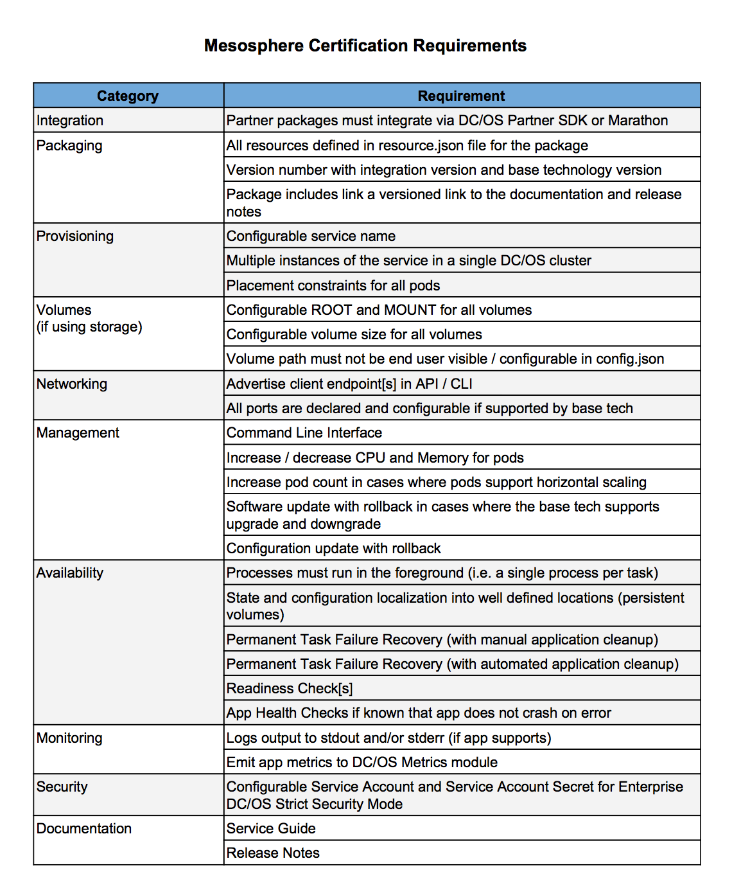

# User Guide: DC/OS Software Development Kit

[[TOC]]

# Introduction

The Software Development Kit (SDK) is a common set of library and tools for easy integration and automation of stateful services with [DC/OS](https://dcos.io/). Frameworks built with the SDK can be published in our [Universe](http://universe.dcos.io/#/) for customers to use. For those frameworks that meet the [beta service requirements](#beta-service-requirements), they will be put on the Universe beta program for customers to try in a production environment. For those frameworks that do not meet the requirements, they will be certified as community packages and can be used for product demos. The goal of the User Guide is to help developers in adding features to the framework, walking through design decisions, providing examples. DC/OS SDK is currently in alpha stage: it can run services, but APIs change regularly, and features are under active development.

The best way to get familiar with the dcos-commons SDK is to start using it. Here are a few recommended first-steps for new-comers:

1. Do the [Quick Start](https://github.com/mesosphere/dcos-commons/blob/master/README.md#quick-start) on the dcos-commons GitHub page. This should help you build a already developed framework, hello-world, and see it live on DC/OS.

2. Read through the [Developer Guide](https://mesosphere.github.io/dcos-commons/developer-guide.html). The Developer guide will help you develop your first framework, hello-world, that you installed in quick start.

4. Create a Kafka framework by following the [Kafka Tutorial](https://mesosphere.github.io/dcos-commons/tutorials/kafka-tutorial.html). This tutorial takes you through the process of actually creating a simple, new framework using the SDK.

5. Bookmark the [YAML Reference](https://mesosphere.github.io/dcos-commons/yaml-reference.html).

After going through these steps, you should have a basic understanding of the SDK. You're now ready to create a framework for your own service. Still, we recommend reading through the rest of this document to get an overview of the process / common problems before diving in.

# Prerequisites

We recommend developing in a cloud environment, rather than a local environment. The SDK is currently in alpha stage, and support for local dev environment is in active development. The local development environment using vagrant box is a good way to get started `hello-world` and `kafka` tutorials, but will not be comprehensive in mimicking production environment.

## AWS Development

1. Get & add [AWS credentials](http://docs.aws.amazon.com/sdk-for-java/v1/developer-guide/credentials.html)

    1. Create a file called *aws-key.pem* with format:

      aws_access_key_id = XXX

      Aws_secret_access_key = XXX

    2. Add ssh-add aws-key.pem your bash profile so it runs every time you start up

5. Install DC/OS [Command Line Interface (CLI)] and point it to your cluster(https://dcos.io/docs/1.9/cli/install/)

6. Set up your [S3 bucket](http://docs.aws.amazon.com/AmazonS3/latest/gsg/CreatingABucket.html)


### Local Development Environment

Please refer to the [quick start](https://github.com/mesosphere/dcos-commons#quick-start) section.

# Getting Started

These steps will help you get a template framework built, installed, and running on your DCOS cluster. Once you have your framework running, you can customize it as necessary.

1. Clone [dcos-commons](https://github.com/mesosphere/dcos-commons/)

2. Run `./new-framework.sh frameworks/<framework-name>`.

3. Open up and read through `frameworks/<framework-name>/src/main/dist/svc.yml` and `frameworks/<framework-name>/universe/marathon.json.mustache`. These files will be where you need to do most of your work. Reference the [YAML guide](https://mesosphere.github.io/dcos-commons/yaml-reference.html) to understand `svc.yml` and the [Marathon docs](https://mesosphere.github.io/marathon/docs/) to understand `marathon.json.mustache`.

4. Run `cd frameworks/<framework-name>` before building your package.

5. Make sure you have the DCOS [CLI installed](https://dcos.io/docs/1.9/cli/install/) and pointing to your cluster.

6. To build, run `./build.sh <aws | local>`. If using AWS, make sure your credentials are set as environment variables (`AWS_ACCESS_KEY_ID` and `AWS_SECRET_ACCESS_KEY`) and that you have your [S3 bucket set up](http://docs.aws.amazon.com/AmazonS3/latest/gsg/CreatingABucket.html). If using local, make sure you have a local DCOS cluster running.

7. After it finishes running, the build script will print instructions for installing/uninstalling your package on DCOS. Please follow instructions to install. It should look similar to the following:
```
(Re)install your package using the following commands:
dcos package uninstall <framework name>
dcos node ssh --master-proxy --leader "docker run mesosphere/janitor /janitor.py -r <framework name>-role -p <framework name>-principal -z dcos-service-<framework name>"
dcos package repo remove <framework name>-aws
dcos package repo add --index=0 <framework name>-aws https://infinity-artifacts.s3.amazonaws.com/.../-<framework name>.json
dcos package install --yes <framework name>
```

# Making Changes To An Existing Framework

## Adding Config Files



1. Add a `tasks:<task-name>:configs:` field as pictured above.

2. Add any number of named configs with the required `template:` and `dest:` fields. Refer to the [YAML Reference](https://mesosphere.github.io/dcos-commons/yaml-reference.html) for more information on these fields.

3. Add your templated config files to `<root-framework-dir>/src/main/dst/`.

4. `cd` into `<root-framework-dir>/src/main/resources/`. For each of the config files from the previous step, run `ln -s ../<config-file> <config-file>`. Essentially, each config file should live in `dist/` and have a symlink in `resources/`.

5. Add the bootstrap task as described in the [Developer Guide](https://mesosphere.github.io/dcos-commons/developer-guide.html#task-bootstrap).

# Development

## Beta Service Requirements

In order for a framework to be Mesosphere certified and enroll in the Beta program, they must meet a baseline level of service requirements. These requirements are best practices that allow for our partners to easily maintain the frameworks. Community driven frameworks that do not meet these beta requirements may be on the Universe, but will not be certified and is not recommended for use in a production environment.



## Adding Features

### Exposing the CLI

Once you have created the template for your framework using

`./new-framework.sh` you will notice that you have file `main.go`  under
`/dcos-commons/framework/<your-framework>/cli/dcos-<your-framework>`. This file should contain a template file such as the following:

```

package main

import (

	"github.com/mesosphere/dcos-commons/cli"

	"gopkg.in/alecthomas/kingpin.v2"

)

func main() {

	app := cli.New()

	cli.HandleDefaultSections(app)

	kingpin.MustParse(app.Parse(cli.GetArguments()))

}

```

In order to expose the CLI commands, you will be writing in Go. [CLI documentation](https://github.com/mesosphere/dcos-commons/tree/master/cli) is a great reference point.

##### Example: CockroachDB

For example, suppose that for my CockroachDB framework I wish to expose the CLI command `version`. When using the CockroachDB CLI, the command is `cockroach version`. In DC/OS CLI, the equivalent command is `dcos task exec -it cockroachdb-0-node-init ./cockroach version`, where we interactively call `version` in the folder `./cockroach` that were created in initialization on the first node, named `cockroachdb-0-node-init`

However, we wish reduce the above command and allow the user to call, `dcos cockroachdb version` Then, we must add the following code snippets to main.go

A `runDcosCommand` helper function to process the command line arguments

```

func runDcosCommand(arg ...string) {

	cmd := exec.Command("dcos", arg...)

	cmd.Stdin = os.Stdin

	cmd.Stdout = os.Stdout

	cmd.Stderr = os.Stderr

	err := cmd.Run()

	if err != nil {

		fmt.Printf("[err] %s\n", err)

	}

}

```

A `version` function that will call the equivalent of `dcos task exec -it cockroachdb-0-node-init ./cockroach version`

```

func version(c *kingpin.ParseContext) error {

	runDcosCommand("task",

			"exec",

			"-it",

			"cockroachdb-0-node-init",

			"./cockroach",

			"version")

	return nil

}

```

A `handleCockroachSection` that describes the command in the CLI. Here, you may add additional CLI arguments that are specific to your framework’s needs.

```

func handleCockroachSection(app *kingpin.Application) {

	app.Command("version", "Output CockroachDB version and dependency details").Action(version)

}

```

Once you add `handleCockroachSection(app)` to the `main()` function, we have integrated CockroachDB CLI with DC/OS CLI for a single command.

### Permanent node replacement

By default, the recovery plan is automatically generated by the scheduler to rerun replacement plan initially defined for the node. However, in case you need to override the default recovery plan, you can also customize your own service to fit your framework's needs.

Under

`/dcos-commons/framework/<your-framework>/src/main/java/com/mesosphere/sdk/<your-framework>/scheduler/`

, there is a java file created called `main.java` It will be created with a template:

```

package com.mesosphere.sdk.<your-framework>.scheduler;

import com.mesosphere.sdk.scheduler.SchedulerFlags;

import com.mesosphere.sdk.specification.*;

import java.io.File;

/**

 * Template service.

 */

public class Main {

    public static void main(String[] args) throws Exception {

        if (args.length > 0) {

            new DefaultService(new File(args[0]), SchedulerFlags.fromEnv()).run();

        }   

    }   

}

```

##### Example: CockroachDB

For example, in CockroachDB, the behavior of the first node is different from the other node as it needs to initialize the whole database. Assume that there is a service failure with this first node where the data in the node is permanently removed. Under the current plan defined in `syc.yml`, it will initialize a stand-alone database which make two separate disconnected database.

Therefore, in such failure scenario, we wish to override the first node behavior and let it join the existing database.

We define `CockroachdbService` class that extends `DefaultService` to include the customized `RecoveryPlanOverriderFactory`.

```

/**

 * CockroachDB Service.

 */

public class CockroachdbService extends DefaultService {

    protected static final Logger LOGGER = LoggerFactory.getLogger(CockroachdbService.class);

    public CockroachdbService(File pathToYamlSpecification) throws Exception {

        super(createSchedulerBuilder(pathToYamlSpecification));

    }   

    private static DefaultScheduler.Builder createSchedulerBuilder(File pathToYamlSpecification)

            throws Exception {

        SchedulerFlags schedulerFlags = SchedulerFlags.fromEnv();

        RawServiceSpec rawServiceSpec = RawServiceSpec.newBuilder(pathToYamlSpecification).build();

        DefaultScheduler.Builder schedulerBuilder =

                DefaultScheduler.newBuilder(

                        DefaultServiceSpec.newGenerator(rawServiceSpec, schedulerFlags).build(),

                        schedulerFlags)

                        .setPlansFrom(rawServiceSpec)

                        .setRecoveryManagerFactory(new CockroachdbRecoveryPlanOverriderFactory());

        return schedulerBuilder;

    }   

}

```

We implement `RecoveryPlanOverriderFactory` as `CockroachdbRecoveryPlanOverriderFactory`. In this example, we choose the `replace` plan as the base plan to generate our `recovery` plan.

```

/**

 * This class generates {@link CockroachdbRecoveryPlanOverrider}s.

 */

public class CockroachdbRecoveryPlanOverriderFactory implements RecoveryPlanOverriderFactory {

    private static final String REPLACE_PLAN_NAME = "replace";

    @Override

    public RecoveryPlanOverrider create(

            StateStore stateStore,

            ConfigStore<ServiceSpec> configStore,

            Collection<Plan> plans) {

        return new CockroachdbRecoveryPlanOverrider(

                stateStore,

                configStore,

                getNodeReplacementPlan(plans));

    }   

    private Plan getNodeReplacementPlan(Collection<Plan> plans) {

        Optional<Plan> planOptional = plans.stream()

                .filter(plan -> plan.getName().equals(REPLACE_PLAN_NAME))

                .findFirst();

        if (planOptional.isPresent()) {

            return planOptional.get();

        } else {

            throw new RuntimeException("Failed to find plan: " + REPLACE_PLAN_NAME);

        }   

    }   

}

```

We define the detailed recovery plan generation in `CockroachdbRecoveryPlanOverrider` class that implements  `RecoveryPlanOverrider`. Within this class, we override the recovery behavior if the current failure is classified as permanent failure. In this example, we simply take all the phases in the `replace` to form our `recovery` plan.		

```

    @Override

    public Optional<Phase> override(PodInstanceRequirement stoppedPod) {

        if (stoppedPod.getPodInstance().getIndex() != 0) {

            logger.info("No overrides necessary. Pod is not cockroachdb-0.");

            return Optional.empty();

        }   

        if (stoppedPod.getRecoveryType() != RecoveryType.PERMANENT) {

            logger.info("No overrides necessary, RecoveryType is {}.", stoppedPod.getRecoveryType());

            return Optional.empty();

        }   

        stateStore.clearTask("cockroachdb-0-node-init");

        logger.info("Returning replace plan for cockroachdb-0");

        return Optional.ofNullable(getNodeRecoveryPhase(replaceNodePlan));

    }   

    private Phase getNodeRecoveryPhase(Plan inputPlan) {

        Phase inputPhase = inputPlan.getChildren().get(0);

        Step inputStep = inputPhase.getChildren().get(0);

        PodInstanceRequirement joinPodInstanceRequirement =

             PodInstanceRequirement.newBuilder(

                    inputStep.start().get().getPodInstance(),

                    inputStep.start().get().getTasksToLaunch()

                    )   

            .recoveryType(RecoveryType.PERMANENT)

            .build();

        Step joinStep = new DefaultRecoveryStep(

                inputStep.getName(),

                Status.PENDING,

                joinPodInstanceRequirement,

                new UnconstrainedLaunchConstrainer(),

                stateStore);

        Phase phase = new DefaultPhase(

                RECOVERY_PHASE_NAME,

                Collections.singletonList(joinStep),

                new SerialStrategy<>(),

                Collections.emptyList());

        return phase;

      }   

}

```

Finally, we substitute the original `DefaultService` in `Main.java` with our `CockroachdbService` to enable customized recovery plan.

### Backup / Restore

To ensure the durability of your system, you may want to backup your system state at some point. You can define your own backup and restore plan for your framework in your `ServiceSpec` file. The following script is a convenient way to run aws-cli with the help of docker. Note that we mount the current directory into the docker container to help with local file transfer.

in `aws.sh.mustache`

```

#!/usr/bin/env bash

set -o errexit

set -o nounset

set -o pipefail

# enable interruption signal handling

trap - INT TERM

docker run --rm \

         -t $(tty &>/dev/null && echo "-i") \

         -e "AWS_ACCESS_KEY_ID=${AWS_ACCESS_KEY_ID}" \

         -e "AWS_SECRET_ACCESS_KEY=${AWS_SECRET_ACCESS_KEY}" \

         -e "AWS_DEFAULT_REGION=${AWS_DEFAULT_REGION}" \

         -v "$(pwd):/project" \

         mesosphere/aws-cli \

         $@  

```

The basic usage of this script is the same as using the aws-cli just change the command `aws [command]` to `./aws.sh [command]`.

##### Example: CockroachDB

In the CockroachDB example, we’d like to backup specific database at a given point. We choose to upload the backup data to Amazon S3 and restore from it once necessary.

The backup and restore plan are as follows in `svc.yml`. In our case, as we only need to run backup/restore on one node, so the `strategy`
of all these two plans are `serial`. You may want to choose your own `strategy` based on specific backup/restore mechanism in your system.

```

  backup:

    strategy: serial

    phases:

      backup-test:

        strategy: serial

        pod: sidecar

        steps:

          - default: [[backup]]

  restore:

    strategy: serial

    phases:

      backup-test:

        strategy: serial

        pod: cockroachdb

        steps:

          - 0: [[restore]]

          - default: [[]]

```

And the detailed info of the backup and restore tasks are as follows.

```

backup:

        goal: FINISHED

        configs:

          aws:

            template: "{{CONFIG_TEMPLATE_PATH}}/aws.sh.mustache"

            dest: "aws.sh"

        cmd: "./bootstrap --resolve=false && \

              chmod +x $MESOS_SANDBOX/aws.sh && \    

              mkdir backup && \

              touch backup/$DATABASE_NAME.sql && \

              $MESOS_SANDBOX/{{COCKROACH_VERSION}}/cockroach dump $DATABASE_NAME --insecure \

              --host='internal.cockroachdb.l4lb.thisdcos.directory' > \

              backup/$DATABASE_NAME.sql && \

              $MESOS_SANDBOX/aws.sh s3 cp \

              backup/$DATABASE_NAME.sql \

              s3://$S3_BUCKET_NAME/$S3_DIR_PATH/$BACKUP_DIR/"

        resource-set: sidecar-resources

...

restore:

        goal: FINISHED

        configs:

          aws:

            template: "{{CONFIG_TEMPLATE_PATH}}/aws.sh.mustache"

            dest: "aws.sh"

        cmd: "./bootstrap && \

              chmod +x $MESOS_SANDBOX/aws.sh && \

              mkdir restore && \

              $MESOS_SANDBOX/aws.sh s3 cp \

              s3://$S3_BUCKET_NAME/$S3_DIR_PATH/$BACKUP_DIR/$DATABASE_NAME.sql \

              restore/ && \

              $MESOS_SANDBOX/{{COCKROACH_VERSION}}/cockroach sql --insecure \

              --execute=\"CREATE DATABASE IF NOT EXISTS $DATABASE_NAME\" \

              --host='internal.cockroachdb.l4lb.thisdcos.directory' && \

              $MESOS_SANDBOX/{{COCKROACH_VERSION}}/cockroach sql \

              --database=$DATABASE_NAME --insecure \

              --host='internal.cockroachdb.l4lb.thisdcos.directory' < \

              restore/$DATABASE_NAME.sql"

        resource-set: sidecar-resources

```

When backup plan is executed, we first dump all data to a SQL file and upload this file to Amazon S3. Reversely, when executing the replace plan, we first fetch the related SQL file and then restore the database based on the SQL file.


### Deployment Plan Strategy

The design choices for the `svc.yml` file have performance and functionality consequences that one must consider. For example, upgrade and replace plan are generally used in serial strategy, but in our example CockroachDB scenario, parallel replace strategy is optimal:

```

  replace:

    strategy: parallel

    phases:

      node-deploy:

        strategy: parallel

        pod: cockroachdb

        steps:

          - default: [[node-join]]

```

In our example database, CockroachDB, the nodes need to meet a quorum for replacement. Suppose we have a 3 node cluster and 2 nodes crash simultaneously. With the serial replace strategy, the second node will wait for third node which has also crashed. Therefore, we will never reach a quorum and will not be an effective crash recovery strategy. Therefore, in order to replace as quickly as possible, the we use a parallel replacement strategy. However, for an update plan, we use a serial strategy in order to upgrade without disruption.

### App Metrics

Although some frameworks have their metrics dashboard which can be linked from the [DC/OS dashboard](https://dcos.io/docs/1.9/developing-services/#-a-name-adminrouter-a-admin-router-and-web-interface-integration), we highly recommend apps emit their service metrics to Mesos and DC/OS.

Mesos advertises two environmental variables to each container: `STATSD_UDP_PORT` and `STATSD_UDP_HOST` Any statsd-format data sent to that advertised endpoint will automatically go into the metrics stack.

If your framework has a plug-in or an extension which supports directly emitting `statsd`, you could provide that with the environment advertised endpoint. An [example statsd emitter](https://github.com/dcos/dcos-metrics/tree/master/examples/statsd-emitter) is provided here as reference.

If that is not possible, one could create a lightweight sidecar to periodically collect metrics from CockroachDB and emit them in the proper format to those ports. Statsd is a simple format of Udp packets containing one or more newline separated values: `my.value:5|g|#tag1:value1,tag2,value2`

### Container Network Interface (CNI)

Connecting the framework to the Container Network Interface allows DC/OS to assign Virtual IPs to each container, and provides an easy networking abstraction layer. To connect the framework to the CNI,

1. Set the [virtual network](https://github.com/mesosphere/dcos-commons/blob/master/frameworks/template/universe/config.json#L60) in the `config.json` as true

2. Allow for toggle of the virtual network in `svc.yml`

```

    {{#ENABLE_VIRTUAL_NETWORK}}

    networks:

      dcos:

    {{/ENABLE_VIRTUAL_NETWORK}}

```

3. Allow for toggling of virtual network in `marathon.json.mustache`

```

    {{#service.virtual_network}}

    "ENABLE_VIRTUAL_NETWORK": "yes",

    {{/service.virtual_network}}

```

# Testing

## Unit Tests

### Prerequisites

1. Have gradle installed on your computer.

```
brew install gradle
```

2. Confirm that you have [Junit](http://junit.org/junit4/) properly configured in your machine

### Running Unit Tests

* All tests: `./gradlew check`

* Individual framework: `./gradlew check -p frameworks/<framework-name>`

## Integration Tests

[Shakedown](https://github.com/dcos/shakedown) is a library that provides the majority of the functionality required to write integration tests is. Shakedown provides capabilities that make it easy to perform service operations such as install, uninstall, configuration update, software upgrade, rollback, and pod restart. [Shakedown API ](https://github.com/dcos/shakedown/blob/master/API.md)and Shakedown [SDK](https://github.com/mesosphere/dcos-commons/tree/master/testing)[ specific testing library](https://github.com/mesosphere/dcos-commons/tree/master/testing) are good reference points. Helloworld framework provides some example [tests](https://github.com/mesosphere/dcos-commons/tree/master/frameworks/helloworld/tests) that use the above mentioned libraries.

### Prerequisites

#### Local Development Environment

Please refer to the [Integration Test Section](https://mesosphere.github.io/dcos-commons/developer-guide.html#integration-tests) of the Developer Guide for Integration Test activation.

#### AWS Cloud Environment

1. Make sure you have [shakedown](https://github.com/dcos/shakedown) installed. The simplest way to install is using pip

```
pip install dcos-shakedown

apt-get update

apt-get install python3 python3-pip build-essential libssl-dev libffi-dev python-dev

pip3 install dcos-shakedown
```

2. Navigate to the folder your framework

3. Build the framework, if it is not built already

```
./build.sh aws
```

CLI should print the commands to add and install the framework to the universe. It should look similar to

`dcos package repo add --index=0 <package name>-aws <s3-bucket>.json`

1. Run the command specified by the CLI and add the built framework to your universe, if not added already

### Running the Tests


Shakedown will discover all integration tests within your folder structure to test.

2. Run shakedown

```
shakedown --dcos-url=<your_cluster_url> -n <dcos user id> -w <dcos pw>
```

To print the standard output of tests for debugging, run

```
shakedown --dcos-url=<your_cluster_url> -n <dcos user id> -w <dcos pw> -o all
```

# Appendix

### Quick Fixes

- **Problem**: python3 not installed on virtualbox

  **Solution**: `sudo yum install python34`

- **Problem**: packages aren’t installing correctly

  **Solution**: try using `pip3` instead of `pip`

- **Problem**: cryptography package from Shakedown env (integration testing) won’t compile

  **Solution**: [https://github.com/pyca/cryptography/issues/2692](https://github.com/pyca/cryptography/issues/2692)  

- **Problem**: Native build SHA1 mismatch or missing output

  **Solution**: `ln -s /usr/bin/sha1sum /usr/bin/shasum`

- **Problem**: I am trying to launch multiple instances of a service in a single DC/OS cluster to pass the beta requirements. There are issues when I launch my framework with a configured service name.

  **Solution**: Try removing special characters such as `.`, `__`, and `-` from the Service Name
